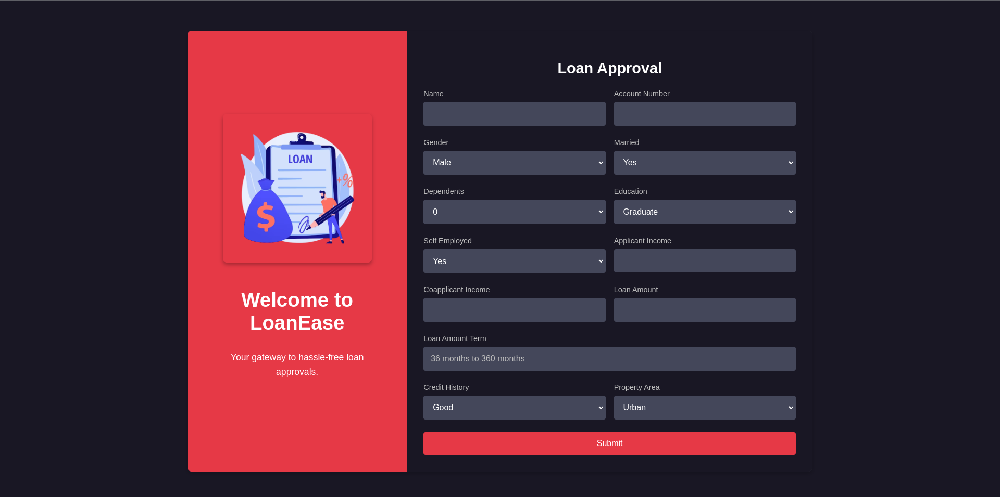
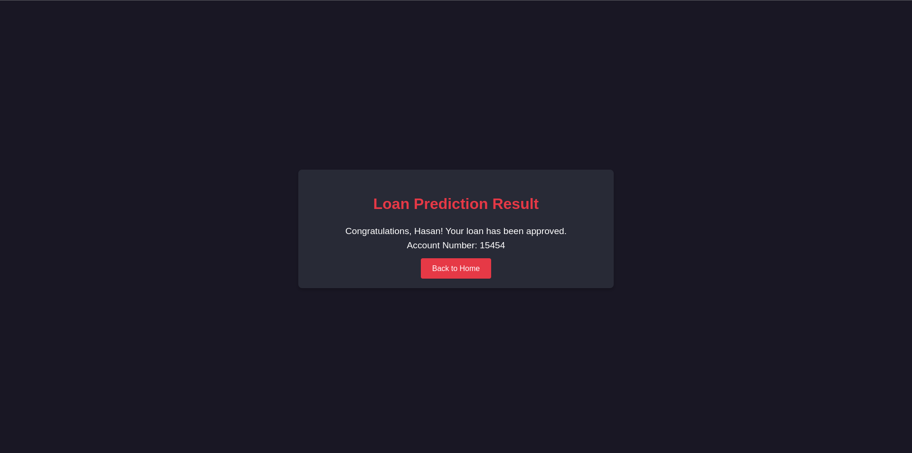
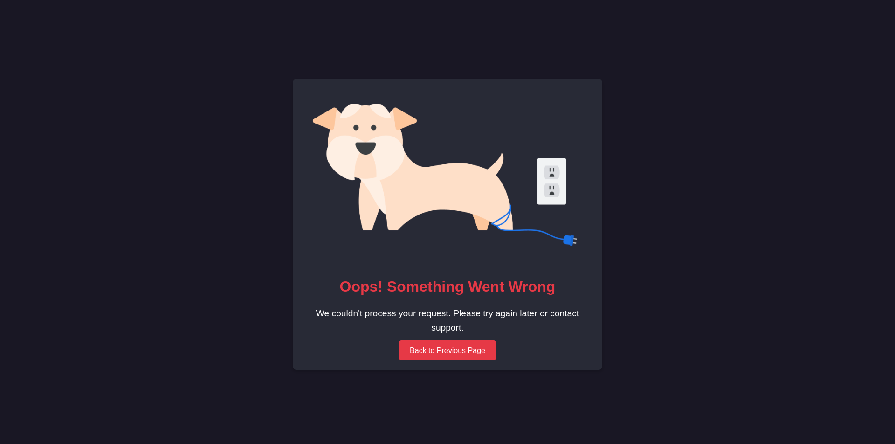

# LoanEase - Loan Prediction App

LoanEase is a Flask-based web application designed to predict loan approval status using machine learning. The app uses a trained Gaussian Naive Bayes model to provide instant predictions based on user-provided input. It is deployed on **Railway** for ease of access.

---

## Features

- User-friendly loan approval form.
- Predicts loan approval status using machine learning.
- Validates user inputs (e.g., applicant income, loan amount, loan term).
- Displays personalized prediction results.
- Handles errors gracefully with descriptive error messages.
- Deployed on Railway for seamless access.

---

## Technologies Used

- **Python**: Core programming language.
- **Flask**: Web framework for building the app.
- **Machine Learning**: Gaussian Naive Bayes model for prediction.
- **HTML/CSS**: Frontend templates and styling.
- **Railway**: Cloud platform for app deployment.

---

## Folder Structure

```plaintext
.
├── Dockerfile             # Docker instructions for building the app
├── app.py                 # Flask application entry point
├── core
│   ├── __init__.py        # Core package initializer
│   ├── model_storage
│   │   └── gnb_model.pkl  # Pre-trained Gaussian Naive Bayes model
│   ├── models.py          # Model loading and prediction logic
│   ├── request.py         # Input parsing and validation
│   ├── routes.py          # Flask app routes
│   ├── static
│   │   ├── css
│   │   │   └── style.css  # Styling for the app
│   │   └── images
│   │       ├── favicon.ico  # App icon
│   │       └── loan.png     # Logo for branding
│   └── templates
│       ├── error.html      # Error page template
│       ├── index.html      # Loan application form
│       └── prediction.html # Prediction result display
├── project_images          # Documentation screenshots
│   ├── home.png            # Screenshot of the Home Page
│   ├── prediction.png      # Screenshot of the Prediction Page
│   ├── error.png           # Screenshot of the Error Page
├── requirements.txt        # Python dependencies
├── docker-compose.yml      # Docker Compose configuration
├── README.md               # Project documentation
```

## INSTALLATION GUIDE LOCAL

### Step 1: Clone the repository

```bash
git clone https://github.com/msjahid/loan-approval-analysis.git
cd loan-approval-analysis
```

### Step 2: Set up a virtual environment

```bash
python -m venv venv
source venv/bin/activate # On Windows: venv\Scripts\activate
```

### Step 3: Install dependencies

```bash
pip install -r requirements.txt
```

### Step 4: Run the Flask app

```bash
python app.py
```

### Step 5: Open the app in your browser

```bash
http://127.0.0.1:5000/
```

## INSTALLATION GUIDE DOCKER

### Step 1: Prerequisites

- **Docker and Docker Compose installed on your machine.**
- **Your project structured properly (as defined earlier).**

### Step 2: Build the Docker Image

From the project directory, run the following command to build the Docker image:

```bash
docker-compose build
```

### Step 3: Run the Application

Start the application using:

```bash
docker-compose up
```

This will:

- **Build the Docker container if it hasn’t been built already.**
- **Start the Flask application inside the container.**

### Step 4: **Access the Application**

Once the container is running, open your browser and navigate to: Check your port number

```bash
http://127.0.0.1:4000
```

## DEPLOYMENT ON RAILWAY

### Step 1: Sign up or log in to Railway

Visit [https://railway.app/](https://railway.app/) and create an account.

### Step 2: Create a new project

- Click "New Project" → "Deploy from GitHub repo".
- Select your repository (e.g., `loanease-app`).

### Step 3: Configure the deployment

- Railway auto-detects the Procfile and runtime.txt.
- Ensure dependencies in requirements.txt are accurate.

### Step 4: Deploy the app

- Wait for the build and deployment to complete.

### Step 5: Access the app

Railway provides a unique URL (e.g., [https://loanease-app.up.railway.app/](https://loanease-app.up.railway.app/)).

## INPUT VALIDATION RULES

1. Name: Cannot be empty or "0".
2. Account Number: Cannot be "0".
3. Applicant Income: Must be greater than 0.
4. Loan Amount: Must be greater than 0.
5. Loan Term: Must be at least 36 months.
6. Credit History: Must be valid (0 or 1).

## PAGE PREVIEW SCREENSHOTS

### 1. Home Page

- Displays the loan application form.
- Includes input fields for Name, Account Number, Income, etc.

  

### 2. Loan Prediction Page

- Displays the loan prediction result.
- Shows personalized messages based on prediction status.



### 3. Error Page

- Displays descriptive error messages for invalid inputs.
- Includes a visual illustration for better UX.



## EXAMPLE WORKFLOW

### INPUT

Name: Hasan
Account Number: 123456
Applicant Income: 5000
Loan Amount: 150
Loan Term: 360
Credit History: 1
Property Area: Urban

### OUTPUT (Approved)

```bash
Congratulations, Hasan! Your loan has been approved.
Account Number: 123456
```

### OUTPUT (Not Approved)

```bash
Unfortunately, Hasan your loan has not been approved.
Account Number: 123456
```

## CONTRIBUTING

### Steps to contribute:

1. Fork the repository.
  
2. Create a new branch for your feature:
  `git checkout -b feature-name`
  
3. Commit your changes:
  `git commit -m "Add new feature"`
  
4. Push to your branch:
  `git push origin feature-name`
  
5. Submit a pull request for review.
  

## LICENSE

This project is open-source and available under the MIT License.

## CONTACT

- **Author**: Jahid Hasan
- **GitHub**: [https://github.com/msjahid](https://github.com/msjahid)
- **Email**: [msjahid.ai@gmail.com](mailto:msjahid.ai@gmail.com)
